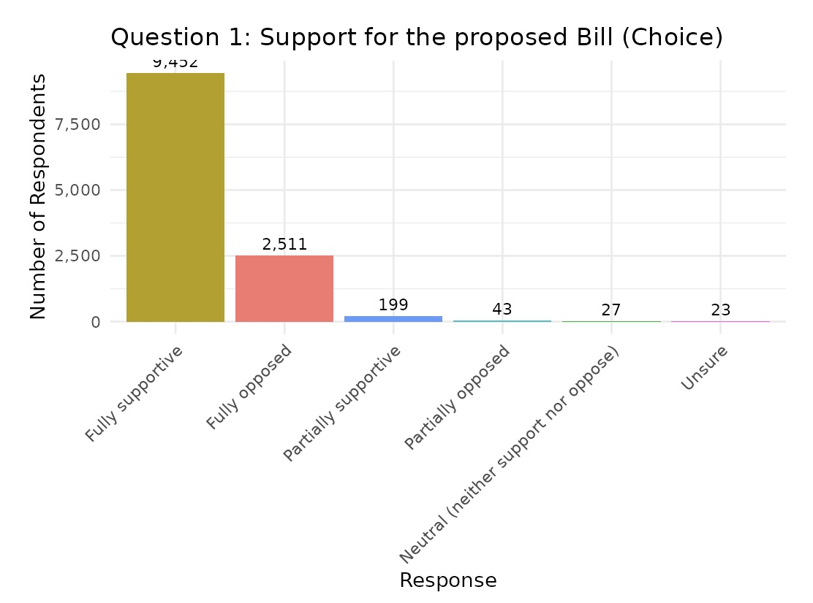
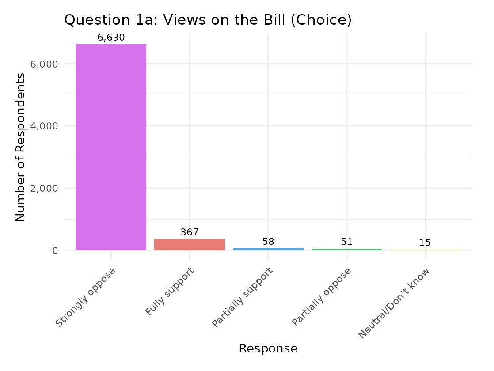
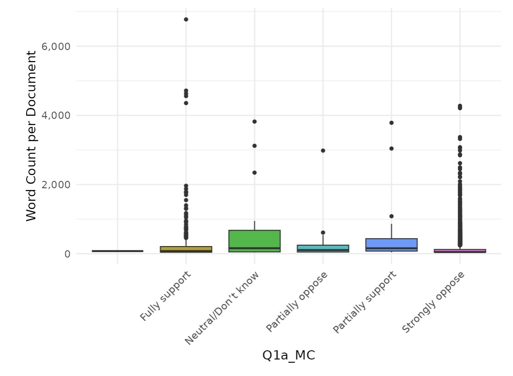
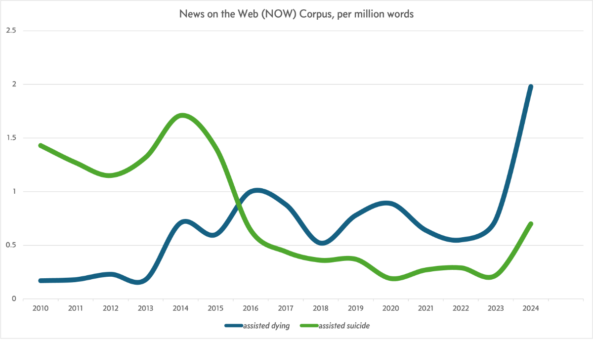
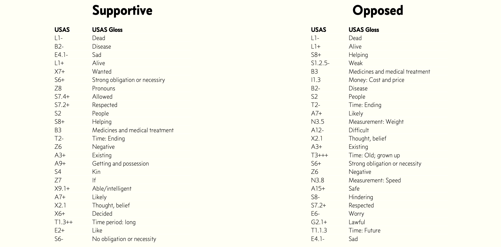

## Content Advisory

* Death (throughout)
* Suicide (throughout)
* Suffering at end of life (throughout)
* Abortion (brief mention in texts)

--

## Background
* Assisted dying: Providing terminally ill people the means to end their lives at their choosing
* Topic of intense debate globally for many years
* Active discussions in Scotland for over a decade
* Scottish Parliament has considered multiple proposed laws since 2010
* Currently examining a new bill (2024-2025)

--

## Previous Attempts
* 2010: First bill introduced by Margo MacDonald MSP (lived with Parkinson's Disease)
  * Failed by 85 votes to 16 (2 abstentions)
* 2013: Second attempt by MacDonald, who died in 2014
  * Voted down in 2015 by 82 votes to 36
* Note: not a lot of support then, but the "yes" votes doubled between attempts
* Common objections: Safeguarding concerns, drug regulation, healthcare staff conscience

---

## Current Situation
* September 2021: Liam McArthur MSP (Orkney) proposed new bill
* Titled: "Assisted Dying for Terminally Ill Adults (Scotland) Bill"
* Key differences from previous attempts:
  * Limited to terminally ill, mentally competent adults
  * Scottish residency requirement (12+ months)
  * Requires evaluation by two independent doctors
  * Multiple decision points and waiting periods
  * Self-administration requirement

--

## Current Bill: Process
* Structured with safeguards:
  * Initial request
  * Reflection period
  * Final request
* Explicitly addresses previous MSP concerns
* Currently progressing through parliamentary scrutiny
* Will be treated as "conscience vote" (no party mandate)

---

## Consultation Process
* Two consultation stages:
  * First (2021): Conducted by McArthur during bill formulation
    * Largest consultation ever for a Scottish bill (12,255 responses)
  * Second (2024): By Health, Social Care and Sport Committee
    * A ’call for views‘ must take place as part of Stage 1 consideration (7,122 responses)

--

## Questions Asked
* Question 1: Support for the proposed Bill
* Question 2: Do you think legislation is required
* Question 3: Views of the proposed process 
* Question 4: Views on safeguards
* Question 5: Should a body collect data on assisted dying
* Question 6: Views on conscientious objections
* Question 7: Impact on public finances
* Question 8: Impact on protected characteristics
* Question 9: Impact on sustainability
* Question 10: Additional comments or suggestions

--

## Arguments: Opposing
* Concerns about pressure on vulnerable people
* Potential for coercion or mistakes
* Religious objections (sanctity of life)
* "Slippery slope" concerns toward broader application
* Implications for vulnerable groups (disabled persons, abuse victims, pensioners)

--

## Religious Perspective
* Rare joint statement from Church of Scotland and Roman Catholic Church
* "Society is called to care for those who are suffering, not to end their lives"
* "Do not believe that this is the correct approach to the alleviation of suffering"
* Significant given historical sectarian tensions in Scotland

--

## Points in the Consultation
* From the “Easy Read Consultation Summary” (a system for adults with learning disabilities, which requires certain types of clear summaries)
* Supportive: “Lots of these people thought:
  * it would be kind to let adults who are terminally ill have a safe assisted death if they wanted it.
  * it would stop their pain and suffering.
  * assisted dying should be allowed in Scotland because it’s allowed in some other countries.”
* Opposed: “Some people thought:
  * it was wrong for a person to take their own life, or to get help to end their life.
  * it wouldn’t be safe because you wouldn’t know for sure if the person was making the choice for themselves.
  * older people or disabled people might feel worried about other people trying to choose for them. They might feel less important.”

---

## Our Consultation Corpus
* Following discussions with the government and other data holders, we built corpora of the two consultations:
  * 2021: 2 million words across 12,255 written responses
  * 2024: 1.2 million words across 7,122 written responses
* Analysis focuses on free text entries
* Responses categorised by support/opposition stance
* (We built a corpus of the press too, and will discuss it later in the paper)

--

## 2021: Overview
* **Period:** 23 September 2021 – 22 December 2021
* **Individual responses:** 12,255
* **Total word count:** 2,018,421 words
* Response length:
  * Range: 0 to 9,759 words
  * Average: 182 words
  * Median: 99 words

--

## 2021: Stance Breakdown

 <!-- .element height="60%" width="60%" -->

--

## 2021: Stance Breakdown
* **Supportive** (fully or partially):
  * 1,270,565 words
* **Opposed** (fully or partially):
  * 886,000 words
* **Neutral/Unsure:**
  * 29,446 words

--

## 2021: Length by Stance

 <!-- .element height="60%" width="60%" -->

--

## Personal Experience: Supporting
* "It's about choice. Currently, other people's choices prevent those who are terminally ill from dying when they wish to. That's cruel and unfair. It's rarely seen in this way because it is the status quo, but the fact is people are currently being coerced into dying in ways they do not wish to, at a time when they are at their weakest and most vulnerable.  I have direct personal experience of close family members dying in hospital."
* "It's about compassion and autonomy. I have medical knowledge and know that some natural deaths can never be made 'good'. Drugs have their limits."
* "We will surely look back and wonder why it took so very long and why so many people had to yield to a process which denies them control, autonomy and dignity, because we were not brave enough to approach this subject in a calm, rational and compassionate way."

--

## Personal Experience: Supporting
* "I had to watch my dad die of pancreatic cancer."
* "I was fully prepared to put myself at risk and buy him drugs from teh dark web so that he could stop the pain. However, my daddy told me it was too risky for me, as I work in teh legal sector. So I didn't take it any further. But in what world should this be allowed to happen?"
* "I'm sitting here in tears thinking about him. I just wish I hadn't listened to him and got him the drugs. Even in the hospice he was still saying if there was an injection or a pill, he would take it. Nobody should need to go through this. It's killing me. He should have been able to leave on his own terms. He shouldn't have had to suffer and waste away. We don't treat dugs like this."

--

## Religious Perspective: Opposing
* "This is a radical change attacking the very roots of welfare and wellbeing – and trust – and would change society."
* "We were created in the Image of God – and if this goes forward, we are challenging LIFE – and VALUES and STANDARDS. Does LIFE mean we have a new meaning of LIFE? Parts of society decided to take life in the womb before life was born into the world – now some want to end life before life is over."
* "One day each of us has to stand before Almighty God – and answer for the decisions we have made – whether we believe it or not – whether we want to or not."

--

## "Slippery Slope" Concerns
* "Thus Belgium's initial law in 2002 expanded from almost exclusively terminally ill cancer patients to patients with psychological illnesses such as severe depression or personality disorder and more recently to competent minors. In Canada, the 2016 law which allowed medical assisted dying for physical health reasons was expanded in 2021 to include patients with mental health conditions."
* "In Oregon, 5 % of patients dying by assisted suicide gave financial reasons for their decision. Those giving as the reason the '' becoming a burden on family, friends or caregivers'' increased from 13% in 1998 to 55% in 2017."
* "The British Geriatrics Society, the Association for Palliative Medicine of Great Britain and Ireland, the majority of the British Medical Association members who are involved in palliative care or geriatric medicine oppose the legalisation of assisted dying."

--

## 2024: Overview
* **Period:** 7 June 2024 – 16 August 2024
* **Individual responses:** 7,122
* **Total word count:** 805,755 words (1,082,534 when including "Other" responses to multiple-choice questions)
* Response length:
  * Range: 1 to 4,744 words
  * Average: 113 words
  * Median: 32 words

--

## 2024: Stance Breakdown

 <!-- .element height="60%" width="60%" -->

--

## 2024: Stance Breakdown
* **Supportive** (fully or partially):
  * 81,353 words
* **Opposed** (fully or partially):
  * 714,729 words
* **Neutral/Unsure:**
  * 9,673 words

--

## 2024: Length by Stance

 <!-- .element height="60%" width="60%" -->

---

## Terminology
* No terminology choice is neutral in this debate
* "Assisted Dying":
  * Term used in current bill's title
  * Prevalent in consultations and media
  * Primarily used by supporters
  * Distinguished from suicide by supporters of the term as 'people in question are not choosing death over a healthy life'
  * Relatively new term (last 15 years in UK)

--

## Alternative Terminology
* "Assisted Suicide":
  * Primarily used by opponents
  * Argued to be more legally/practically accurate
  * Critics say "assisted dying" is a euphemism
  * Retains moral/religious stigma of suicide
  * "Euthanasia": Not accurate for current bill (euthanasia is physician-administered and this bill requires self-administration)
* "Medical Assistance in Dying (MAiD)": Canadian term sometimes found in the corpus

--

 

<!-- .element: class="r-stretch"; -->

--

## Language Framing
* "Assisted suicide": Can emphasise individual's action
* "Assisted dying": Can emphasise disease process already underway

--

## 2021 question 1 USAS key concepts

 <!-- .element height="100%" width="100%" -->

--

## 2021 question 1 USAS key concepts

 <!-- .element height="100%" width="100%" -->

--

## 2021 question 1 USAS key concepts

 <!-- .element height="100%" width="100%" -->

--

#### Supportive

| USAS | USAS Gloss |
|------|------------|
| L1- | Dead |
| B2- | Disease |
| E4.1- | Sad |
| L1+ | Alive |
| X7+ | Wanted |
| S6+ | Strong obligation or necessity |
| Z8 | Pronouns |
| S7.4+ | Allowed |
| S7.2+ | Respected |
| S2 | People |
| S8+ | Helping |
| B3 | Medicines and medical treatment |
| T2- | Time: Ending |
| Z6 | Negative |
| A3+ | Existing |
| A9+ | Getting and possession |
| S4 | Kin |
| Z7 | If |
| X9.1+ | Able/intelligent |
| A7+ | Likely |
| X2.1 | Thought, belief |
| X6+ | Decided |
| T1.3++ | Time period: long |
| E2+ | Like |
| S6- | No obligation or necessity |

--

### 2021 Q1 USAS ('key concepts') vs BE21, LL

#### Opposed

| USAS | USAS Gloss |
|------|------------|
| L1- | Dead |
| L1+ | Alive |
| S8+ | Helping |
| S1.2.5- | Weak |
| B3 | Medicines and medical treatment |
| I1.3 | Money: Cost and price |
| B2- | Disease |
| S2 | People |
| T2- | Time: Ending |
| A7+ | Likely |
| N3.5 | Measurement: Weight |
| A12- | Difficult |
| X2.1 | Thought, belief |
| A3+ | Existing |
| T3+++ | Time: Old; grown up |
| S6+ | Strong obligation or necessity |
| Z6 | Negative |
| N3.8 | Measurement: Speed |
| A15+ | Safe |
| S8- | Hindering |
| S7.2+ | Respected |
| E6- | Worry |
| G2.1+ | Lawful |
| T1.1.3 | Time: Future |
| E4.1- | Sad |