## Content Advisory

* Death <span class="subtle">(throughout)</span>
* Suicide <span class="subtle">(throughout)</span>
* Suffering at end of life <span class="subtle">(throughout)</span>
* Abortion <span class="subtle">(brief mention in texts)</span>

--

## Assisted Dying

* In texts of citizens writing their opinions, for a government audience, on something as controversial as Assisted Dying, what can corpus linguistics bring to the table?

* Three questions:
  * What is linguistically polarized in this debate?
  * How do these polarized ideas lead to contested meanings?
  * What are some societal implications?

--

## Outline

* Background
* Our Corpora
* Polarization and Entrenchment
* Argumentation and Authority
* Implications and Democracy
* Conclusion

---

# 1. Background

--

<!-- .slide: data-background-image="img/image4.png" data-background-size="contain" -->

--

<!-- .slide: data-background-image="img/image5.png" data-background-size="contain" -->

--

<!-- .slide: data-background-image="img/image6.png" data-background-size="contain" -->

--

<!-- .slide: data-background-image="img/image7.png" data-background-size="contain" -->

--

<!-- .slide: data-background-image="img/image8.png" data-background-size="contain" -->

--

<!-- .slide: data-background-image="img/image9.png" data-background-size="contain" -->

--

<!-- .slide: data-background-image="img/image10.jpeg" data-background-size="contain" -->

--

<!-- .slide: data-background-image="img/image11.jpeg" data-background-size="contain" -->

--

<!-- .slide: data-background-image="img/image12.jpeg" data-background-size="contain" -->

--

<!-- .slide: data-background-image="img/image13.jpeg" data-background-size="contain" -->

notes:
 Assisted dying: Providing terminally ill people the means to end their lives at their choosing
 Topic of intense debate globally for many years
 Active discussions in Scotland for over a decade
 Scottish Parliament has considered multiple proposed laws since 2010
 Currently examining a new bill (2024-2025) introduced by Liam McArthur MSP, Liberal Democrat MSP for the Orkney Islands

Orkney, it should be said, belongs to Scotland because in 1468 a Norwegian king said we could have Orkney should he not pay his daughter's dowry when she was betrothed to James III of Scotland, and he didn't pay so we took Orkney in 1472. Norway in the 17th century tried to pay us 210kg of gold for them but we said no.

 2010: First bill introduced by Margo MacDonald MSP (lived with Parkinson's Disease)
 Failed by 85 votes to 16 (2 abstentions)
 2013: Second attempt by MacDonald, who died in 2014
 Voted down in 2015 by 82 votes to 36
 Note: not a lot of support then, but the "yes" votes doubled between attempts
 Common objections: Safeguarding concerns, drug regulation, healthcare staff conscience

13 May: Assisted Dying Bill passed the first stage of becoming law. First stage means MSPs have considered and approved the "general principles" of it, and they have allowed it to move on to stage 2 – the detailed scrutiny and amendment phase. After MSPs have made and agreed any amendments, the Bill will come back for a final vote to determine whether or not it will become law.

On 16 May (Friday) in England, Kim Leadbeater MP's Terminally Ill Adults (End of Life) Bill is due to return to the House of Commons.

--

## Personal Experience

<div class="slidequote">
For 26 years I worked in the emergency service <span class="subtle">[…]</span> I have witnessed at first hand and close up the sheer desperation and suffering caused by terminal illness. I have had to examine bodies and scenes where the person has died alone and in obvious agony. People with cancer who have vomited and excreted blood and body matter into bowls, coal scuttles, sinks, beds, floors etc.. before finally dying, often over a period of days and weeks  <span class="subtle">[…]</span> I was also called to all suicides and lost count of the number of people I have had to cut down from their nooses whilst their grieving family cried in the adjacent room. <span class="subtle">[…]</span> In April 2020 I was diagnosed with inoperable pancreatic cancer and given 6-12 months to live if I chose not to have palliative chemotherapy, and possibly 18 months if I chose to undertake it. My world fell apart and I had to break the news to my wife and two sons. <span class="subtle">[…]</span> I am a proud and private individual who does not want to spend my final days, weeks, or god forbid months, in a hospital or hospice, in pain with no quality of life and having to be lifted off a bed pan or worse! I do not want to be forced into ending my life alone, maybe in my car with the embers of a disposable BBQ smouldering in the boot, or hanging in a lonely wood waiting for some poor unsuspecting member of the public to find me – but with no compassionate alternative that is what I will do.
</div>

--

## Why Is This Interesting?

* A rich dataset (separate to social media) with citizens writing persuasive texts
* Shows profound disagreements between citizens, and is linguistically highly oppositional
* Broad societal implications of outcomes

--

## Current Situation

* September 2021: Assisted Dying for Terminally Ill Adults (Scotland) Bill
* Key differences from previous attempts:
  * Limited to terminally ill, mentally competent adults
  * Scottish residency requirement (12+ months)
  * Requires evaluation by two independent doctors
  * Multiple decision points and waiting periods
  * Self-administration requirement

notes:
Structured with safeguards:
 Initial request
 Reflection period
 Final request
 Explicitly addresses previous MSP concerns
 Currently progressing through parliamentary scrutiny
 Will be treated as "conscience vote" (no party mandate)

--

<!-- .slide: data-background-image="img/image14.png" data-background-size="contain" -->

--

## Terminology

No terminology choice is neutral in this debate

* **"Assisted Dying"**: Term used in current bill's title
* **"Assisted Suicide"**: Primarily used by opponents
* **"Euthanasia"**: Not accurate for current bill (euthanasia is physician-administered and this bill requires self-administration)

---

# 2. Our Corpora

--

## Corpora

* Consultation Corpus
  * Free text entries from two public consultations
  * Metadata includes self-reported closed question on support/opposition to the bill
  * 2021: 2m words across 12,255 written responses
  * 2024: 1.1m words across 7,122 written responses

* Press Corpus
  * Press articles in the UK from the months surrounding the two consultations
  * Obtained through a set of seed search terms
  * 2021: 2.3m words across 1,668 articles
  * 2024: 2.6m words across 2,969 articles

--

## Consultations

Two consultation stages:

* **First (2021)**: Conducted by McArthur during bill formulation
  * Largest consultation ever for a Scottish bill (12,255 responses)
* **Second (2024)**: By Health, Social Care and Sport Committee
  * A 'call for views' must take place as part of Stage 1 consideration (7,122 responses)

--

## Consultation One

**Period:** 23 September 2021 – 22 December 2021

Individual available responses: 12,255
Word count: 2,018,421

*9,651 fully or partially supportive, 1.2m words
2,554 fully or partially opposed, 0.8m words
50 neutral or unsure, 18k words*

Ranges from 0 to 9,759 words per response (average 182, median 99)

notes:
Organisations 59 (plus 21 emails) = 80

Today for time we're going to look at one question of the individual responses

Five part scale, by the way, and only 3% of respondents expressed a view other than full support or full opposition

26% of all submissions were anonymous

Another 1,322 (9.5% of all submissions) submissions that the respondent marked "not for publication".

--

## Consultation Two

**Period:** 7 June 2024 – 16 August 2024

Individual available responses: 7,122
Word count: 805,755

(1,082,534 when including "Other" responses to multiple-choice questions)

*425 fully or partially supportive, 81,353 words
6,681 fully or partially opposed, 714,729 words*

--

<!-- .slide: data-background-image="img/consultationcomp.png" data-background-size="contain" -->

--

## 2021 Questions

* Question 1: Support for the proposed Bill
* Question 2: Do you think legislation is required
* Question 3: Views of the proposed process
* Question 4: Views on safeguards
* Question 5: Should a body collect data on assisted dying
* Question 6: Views on conscientious objections
* Question 7: Impact on public finances
* Question 8: Impact on protected characteristics
* Question 9: Impact on sustainability
* Question 10: Additional comments or suggestions

notes:
protected characteristics (under the Equality Act 2010): age, disability, gender re-assignment, marriage and civil partnership, pregnancy and maternity, race, religion or belief, sex, sexual orientation

--

<!-- .slide: data-background-image="img/image15.png" data-background-size="contain" -->

--

<!-- .slide: data-background-image="img/image16.jpg" data-background-size="contain" -->

---

# 3. Polarization and Entrenchment

--

## What is Death?

Collocates of *death*:

| 2021 Supportive | | | 2021 Opposed | | |
|-----------------|-------|-------|--------------|-------|-------|
| collocation | count | score | collocation | count | score |
| assisted death | 581 | 3.2 | cause death | 120 | 4.38 |
| dignified death | 198 | 4.51 | natural death | 81 | 4.67 |
| painful death | 190 | 4.1 | death (is) final | 45 | 4.55 |
| bad death | 59 | 4.35 | early death | 42 | 4.34 |
| manner death | 67 | 3.69 | premature death | 41 | 5.3 |
| good death | 86 | 2.64 | choose death | 51 | 3.37 |
| undignified death | 37 | 4.06 | listed death | 31 | 5.17 |
| peaceful death | 39 | 3.67 | physician-assisted death | 29 | 4.86 |

--

## What is Death?

| Supportive | Opposed |
|------------|---------|
| Death is something to be **judged** and part of **medical care**? | Death is something with its own **timescale**, a **threshold** to be respected? |

--

## Key Concepts

* USAS-tagged 2021 corpus (Wmatrix)
* Log-likelihood against BE21 (Paul Baker)

--

<!-- .slide: data-background-image="img/USAS1.jpg" data-background-size="contain" -->

--

<!-- .slide: data-background-image="img/USAS2.jpg" data-background-size="contain" -->

--

<!-- .slide: data-background-image="img/USAS3.jpg" data-background-size="contain" -->

--

## Q1 USAS ('key concepts') against BE21

* **Supportive** top concepts:
  * L1- (Dead), B2- (Disease), E4.1- (Sad), L1+ (Alive), X7+ (Wanted)
  * S6+ (Strong obligation or necessity), Z8 (Pronouns), S7.4+ (Allowed)
  * S7.2+ (Respected), S2 (People), S8+ (Helping)

* **Opposed** top concepts:
  * L1- (Dead), L1+ (Alive), S8+ (Helping), S1.2.5- (Weak)
  * B3 (Medicines and medical treatment), I1.3 (Money: Cost and price)
  * B2- (Disease), S2 (People), T2- (Time: Ending), A7+ (Likely)

--

## 2021 "Easy Read Consultation Summary"

**"Over three quarters supportive"**

"Lots of these people thought:
* it would be kind to let adults who are terminally ill have a safe assisted death if they wanted it.
* it would stop their pain and suffering.
* assisted dying should be allowed in Scotland because it's allowed in some other countries."

notes:
"Easy Read Consultation Summary"
1.5 million people in the UK have learning disabilities. Easy Read is a method of making information easier to understand for this group.

78% pro (76 very and 2 somewhat)

--

## Personal Experience: Supporting

"It's about choice. Currently, other people's choices prevent those who are terminally ill from dying when they wish to. That's cruel and unfair."

"It's about compassion and autonomy. I have medical knowledge and know that some natural deaths can never be made 'good'. Drugs have their limits."

"We will surely look back and wonder why it took so very long and why so many people had to yield to a process which denies them control, autonomy and dignity, because we were not brave enough to approach this subject in a calm, rational and compassionate way."

--

## Personal Experience: Supporting

"I had to watch my dad die of pancreatic cancer."

"I was fully prepared to put myself at risk and buy him drugs from the dark web so that he could stop the pain. However, my daddy told me it was too risky for me, as I work in the legal sector. So I didn't take it any further. But in what world should this be allowed to happen?"

"I'm sitting here in tears thinking about him. I just wish I hadn't listened to him and got him the drugs. Even in the hospice he was still saying if there was an injection or a pill, he would take it. Nobody should need to go through this. It's killing me. He should have been able to leave on his own terms. He shouldn't have had to suffer and waste away. We don't treat dogs like this."

--

## Excerpts

--

## 2021 "Easy Read Consultation Summary"
### "Just under a quarter not supportive"

> "Some people thought:
> * it was wrong for a person to take their own life, or to get help to end their life.
> * it wouldn't be safe because you wouldn't know for sure if the person was making the choice for themselves.
> * older people or disabled people might feel worried about other people trying to choose for them. They might feel less important."

notes:
21%

--

## Religious Perspective: Opposing

> "This is a radical change attacking the very roots of welfare and wellbeing – and trust – and would change society."

> "We were created in the Image of God – and if this goes forward, we are challenging LIFE – and VALUES and STANDARDS. Does LIFE mean we have a new meaning of LIFE? Parts of society decided to take life in the womb before life was born into the world – now some want to end life before life is over."

> "One day each of us has to stand before Almighty God – and answer for the decisions we have made – whether we believe it or not – whether we want to or not."

--

## "Slippery Slope" Concerns

> "Thus Belgium's initial law in 2002 expanded from almost exclusively terminally ill cancer patients to patients with psychological illnesses such as severe depression or personality disorder and more recently to competent minors. In Canada, the 2016 law which allowed medical assisted dying for physical health reasons was expanded in 2021 to include patients with mental health conditions."

> "In Oregon, 5% of patients dying by assisted suicide gave financial reasons for their decision. Those giving as the reason the 'becoming a burden on family, friends or caregivers' increased from 13% in 1998 to 55% in 2017."

> "The British Geriatrics Society, the Association for Palliative Medicine of Great Britain and Ireland, the majority of the British Medical Association members who are involved in palliative care or geriatric medicine oppose the legalisation of assisted dying."

---

## 4. Argumentation and Authority

--

## Unique lexis in supportive subcorpus

**suffering**
* abject, agonies, brutal, crying, hideous, starve, tears, thirst, torment, torture, traumatising, tumours

**humiliation**
* bladder, cleaned, drip, eating, humiliation, incontinence, limbs, nappy, urine, vegetable, wash, wearing

**prolonging**
* drag, dragged, endless, endlessly, lasted, linger

--

## Unique lexis in supportive subcorpus

> "I have seen first hand the unnecessary pain and torment that is caused by this horrific disease."

> "If you'd seen your Parent with advanced Alzheimer's, needing to be fed, washed, nappy changed, YOU WOULDN'T NEED TO ASK!"

--

## "watch* my"

```
positive for Huntington's Disease I've |  watched my   | 3 older siblings deteriorate slowly
                                      I |  watched my   | dad die slowly and painfully
                                I sadly |  watched my   | young brother suffer horrendous pain
            position More than you know |  Watching my  | lovely strong daddy die broke
                                      I |  watched my   | father die a very horrible
                                      I |  watched my   | mother die horribly from terminal
                                      I |  watched my   | daughter die from cancer with
                        When I was 19 I |  watched my   | mother waste away and die
                                      I |   watch my    | father die of cancer slowly
                               I had to |   watch my    | mother suffer excruciating daily pain
                                      I |  watched my   | mum suffer a prolonged and
           before the experience we had |  watching my  | dad suffer for months
                                      I |  watched my   | husband in agony for months
```

notes:
Watch* my

--

## "first hand"

```
pain endured I have whatched | first hand | my granny suffer greatly and
         adult life I have witnessed | first hand | many deaths with many causes
               and MND and have seen | first hand | their suffering at not being
              should end I have seen | first hand | my Father endure an unnecessarily
                living is I have had | first hand | experience of the long protracted
          living I have witnessed at | first hand | the pain and suffering experienced
          family not machines I have | first hand | experience of deaths that were
   consultation document I have seen | first hand | a relative age 55 who
                   so I have seen at | first hand | the physical and psychological damage
```

--

## Unique lexis in opposed subcorpus

**bill as slippery slope**
* eroded, implies, message, normalisation, normalise, opens, promoting, reinforce, sends, signal, subtle, wedge, widen, widened

**value of human life**
* burden, burdensome, contradiction, devalue, undermine, undermines

**appealing to authority**
* American, BMJ, cited, commandments, God's, journal, Mr, professor, shalt, thou

--

## Unique lexis in opposed subcorpus

> "The Bill would send a signal that some lives are no longer worth living."

> "We are also disobeying one of the 10 commandments which states 'thou shalt not kill'."

--

## "clear message"

```
             society This bill sends a | clear message | that some lives have actually
                   and it would send a | clear message | to our frail elderly and
              Assisted suicide sends a | clear message | to frail elderly disabled people
    suffering Assisted suicide sends a | clear message | to frail elderly and disabled
             suffering It also sends a | clear message | to frail elderly and disabled
              Assisted suicide sends a | clear message | to frail elderly and disabled
    suffering Assisted suicide sends a | clear message | to frail elderly and disabled
    suffering Assisted suicide sends a | clear message | to frail elderly and disabled
              Assisted suicide sends a | clear message | to frail elderly and disabled
              Assisted suicide sends a | clear message | to frail elderly and disabled
```

notes:
"clear message"

--

## Comparative USAS, Log Ratio

**Supportive vs Opposed:**
* L2 (Living creatures: animals) - Dogs are 'treated better'
* N3.8- (Speed: Slow) - Prolonged death
* B4 (Cleaning and personal care) - Personal narratives of humiliation

**Opposed vs Supportive:**
* N3.8 (Measurement: Speed) - Slippery slope re: rates
* N3.5 (Measurement: Weight) - Pressure on elderly/sick
* I1.3 (Money: Cost and price) - Danger of 'saving money'
* Z3 (Other proper names) - Appeal to authority

notes:
Weight: pressure
Speed: rate
Short and narrow: thin, as in thin end of the wedge

--

## Overall

| Supportive | Opposed |
|------------|---------|
| animals | slippery slope |
| prolonged death | danger of 'saving money' |
| personal narratives of suffering and humiliation | appeals to authority |
| logical argumentation | too soon |
| **experiential-based** | **principle-based** |

---

## 5. Implications and Democracy

--

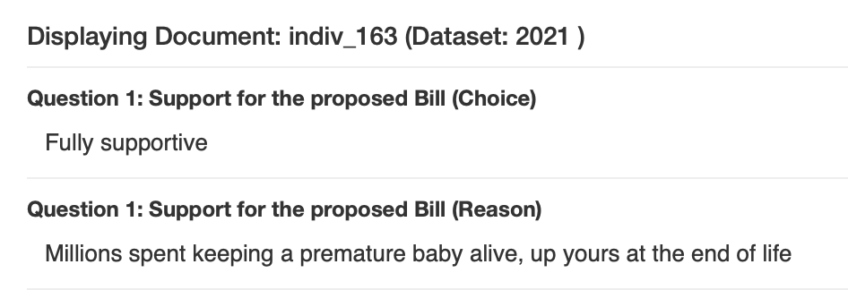 <!-- .element: class="r-stretch" -->

--

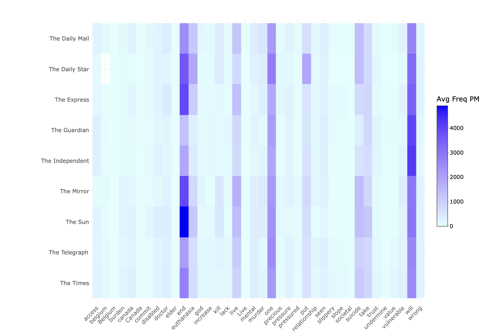 <!-- .element: class="r-stretch" -->

--

## Mail on Sunday (26 December 2023)

> CRISPIN COLEGATE, Pontardawe, Neath Port Talbot. I watched my mother-in-law slowly dying for nearly a year, kept alive by medicines and morphine. She asked me to help her die and I nearly did. Looking back, I wish I had helped her, it would have been worth a prison sentence.

> KEITH McCREADY, Bishop's Stortford, Herts. IF I had let any of my pets suffer as Sarah Vine's grandmother did in her last days (Mail), I would be prosecuted for cruelty.

--

## Mirror (23 October 2021)

> Critics fear it could leave vulnerable people exposed to unwanted pressure. Opponents include the Archbishop of Canterbury, the Most Rev Justin Welby. He said that while the safeguards in the bill are stronger than in previous attempts, they still do not go far enough. "What we want is assisted living, not assisted dying," he said.

--

## Political Opinions

Traditionally:

| "Left Wing" | "Right Wing" |
|-------------|--------------|
| Collective protection of the weak and vulnerable in society | Individual responsibility and personal freedom |
| Progressive values | Conservative values |

--

## Political Opinions

**But:**

* Discourse **opposing** AD is about collective protection of the weak
* Discourse **supporting** AD is about personal responsibility and freedom

--

## Most Frequent Shared Sentences

| Shared Sentence Text | Docs | Supportive | Opposed | Neutral |
|---------------------|------|------------|---------|---------|
| no safeguards are good enough. | 26 | 0 | 26 | 0 |
| creating a body responsible for reporting and collecting data can not address possible abuse. | 25 | 0 | 24 | 1 |
| terminal illness diagnoses can be unreliable. | 24 | 0 | 23 | 1 |
| this is coercive and has no place in a civilised society. | 23 | 0 | 22 | 1 |
| in the absence of the bill, such pressure would not exist. | 22 | 0 | 22 | 0 |
| life is precious. | 21 | 0 | 21 | 0 |
| life is sacred. | 21 | 0 | 21 | 0 |

notes:
Coordinated identical responses raises important questions about 'astroturfing' versus genuine grassroots participation. When 26 respondents use exactly the same sentence 'no safeguards are good enough', it challenges our understanding of consultation as democratic engagement.

Does digitally-enabled coordination strengthen or undermine public debate?

The patterns suggest that opponents have been more organised in their messaging strategy, while supporters rely more on individualised narrative experiences.

--

## Copy-Paste Evidence

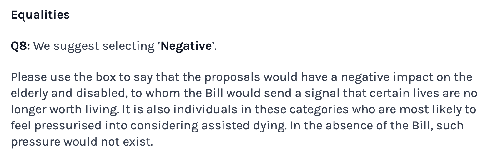 <!-- .element height="40%" width="40%" -->

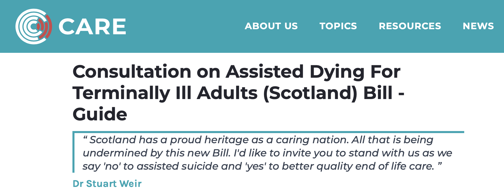 <!-- .element height="40%" width="40%" -->

Two responses (3,758 and 3,991 words) with near-identical text

--

## Word Count Comparison 2021 vs 2024

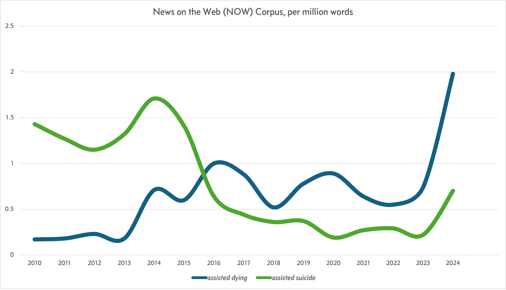 <!-- .element height="60%" width="60%" -->

---

## 6. Conclusion

--

## Our Questions

We began with three questions:

1. What is linguistically polarized in this debate?
2. How do these polarized ideas lead to contested meanings?
3. What are some societal implications?

--

## Elusive Consensus

These linguistic polarisations show societal and ethical divisions. The use of a fundamentally different ethical language means three things are contested in these debates:

* **Contested conceptualization of death**: is death conceptualized as part of medical care (to be optimised) or as a moral threshold (to be respected)?
* **Contested linguistic authority**: experiential-based versus principle-based language: "I watched my mother die" versus "life is always sacred"/"doctors should never kill"; choice/dignity/decide versus vulnerable/pressure/safeguards; crafting individual moral reasoning versus amplifying that of others.
* **Contested meaning of the vulnerable**: those facing painful death or those facing pressure to end their own lives?

--

## "up yours at the end of life"
### Opposition, Emotion, and Overlap in a Corpus of Scottish Debates on Assisted Dying

Marc Alexander and James Balfour

marc.alexander@glasgow.ac.uk, james.balfour@glasgow.ac.uk

CILC16, Salamanca

May 2025

 <!-- .element: class="r-stretch" -->

---

## Appendix

--

## Topic Modelling

* Structural Topic Model (STM) fitted to the combined free-text responses from the 2021 and 2024 consultations
* Respondents classified as 'Supportive' or 'Opposed' based on their answers to initial multiple-choice question
* Preprocessing (lowercasing, removing punctuation/numbers/stopwords, stemming)
* Modelled using STM to identify 60 distinct topics

--

## Topic Model Results

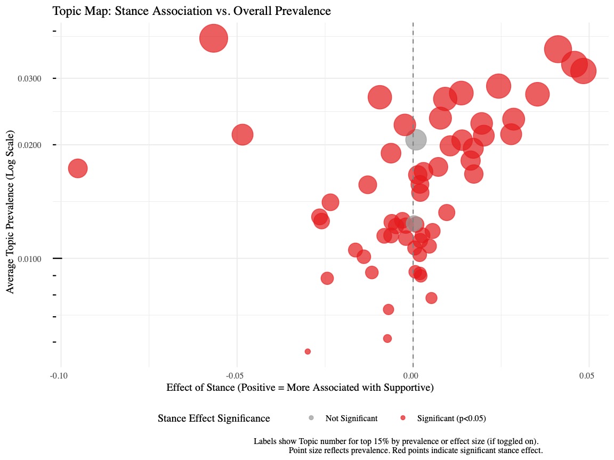 <!-- .element: class="r-stretch" -->

--

## Topic 8

**8: live, elder*, worth, pressu*, end**

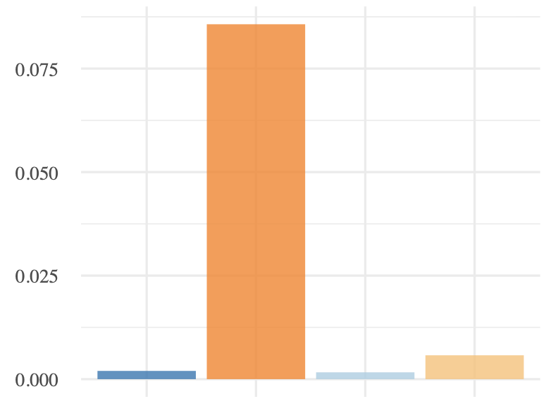 <!-- .element height="60%" width="60%" -->

--

## Topic 32

**32: kill, god, take, murder, one, wrong, precious**

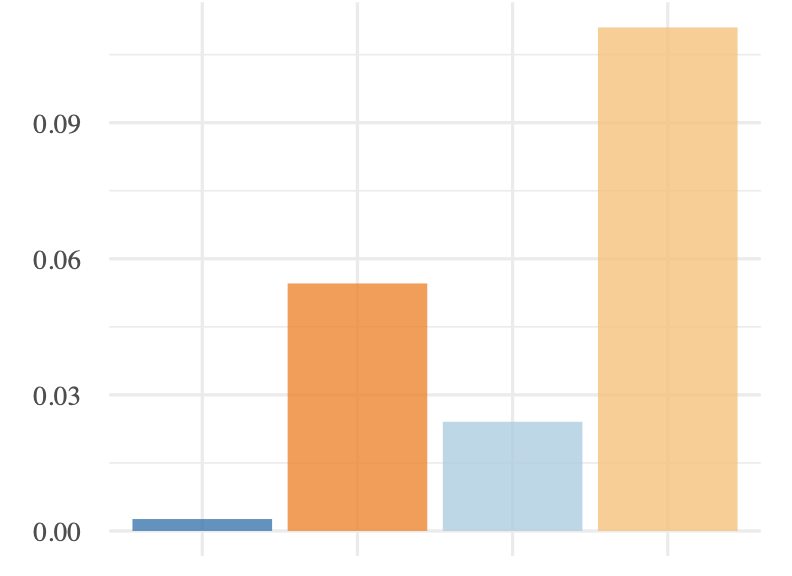 <!-- .element height="60%" width="60%" -->

--

## Topic 50

**50: vulner*, pressure, burden, elder*, disabl***

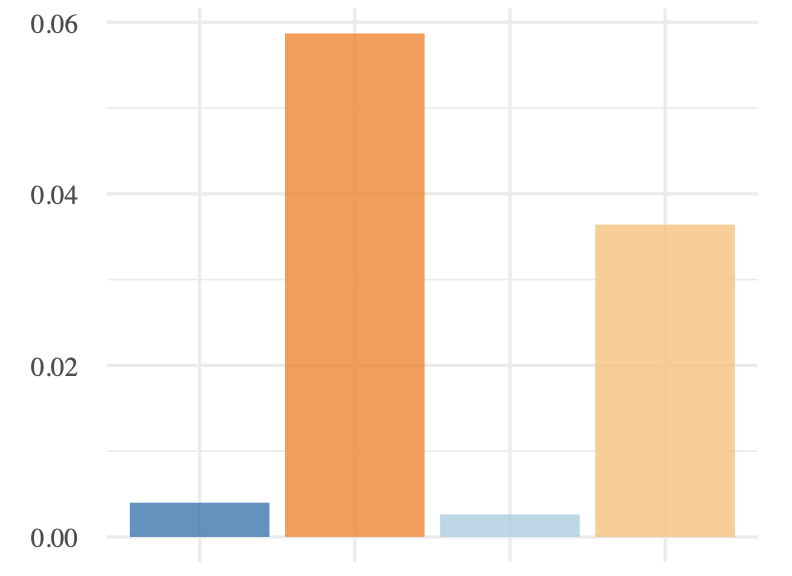 <!-- .element height="60%" width="60%" -->

--

## Topic 29

**29: watch, die, cancer, mother, pass, let**

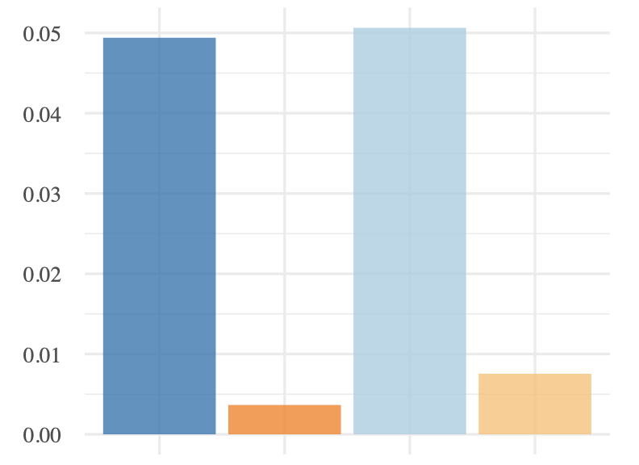 <!-- .element height="60%" width="60%" -->

--

## Topic 40

**40: choice, right, choose, dignity, person, dignif***

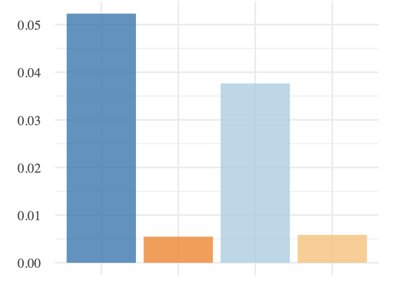 <!-- .element height="60%" width="60%" -->

--

## Topic 16

**16: suffer, pain, one, love, peace, hope, distress**

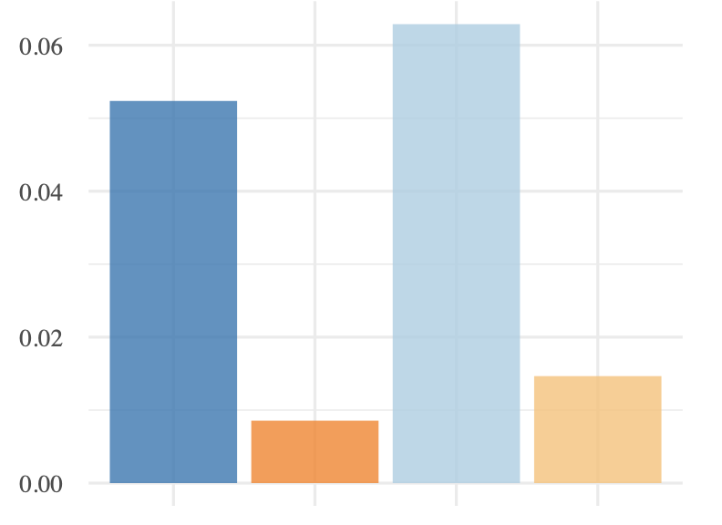 <!-- .element height="60%" width="60%" -->

--

## Press Corpora

UK press articles which meet the following criteria:
* Available on LexisNexis.
* Between 23 March and 22 December 2021 or 7 December 2023 and 16 August 2024.
* Matching search terms "assisted suicide" OR "assisted dying" OR "euthanasia" OR "assisted to die" OR "assisted death" OR "assisted in dying" OR "assisted end to life" OR "death with dignity" OR "die with dignity" OR "die in dignity" OR "right to die" OR "end of life choice" OR "end of life assistance"

--

## Terminology: "Assisted Dying"

* Term used in current bill's title
* Prevalent in consultations and media
* Primarily used by supporters
* Distinguished from suicide by supporters of the term as "people in question are not choosing death over a healthy life"
* Relatively new term (last 15 years in UK)
* Can emphasise disease/death "process" underway

--

## Terminology: "Assisted Suicide"

* Primarily used by opponents
* Argued to be more legally/practically accurate
* Critics say "assisted dying" is a euphemism
* Retains the moral/religious stigma of "suicide"
* Can emphasise individual's action

--

## Terminology: "Euthanasia"

* Greek "good death"
* Not technically accurate for current bill as euthanasia is physician-administered and this bill requires self-administration

--

## NOW Corpus: "Assisted Dying" vs "Assisted Suicide"

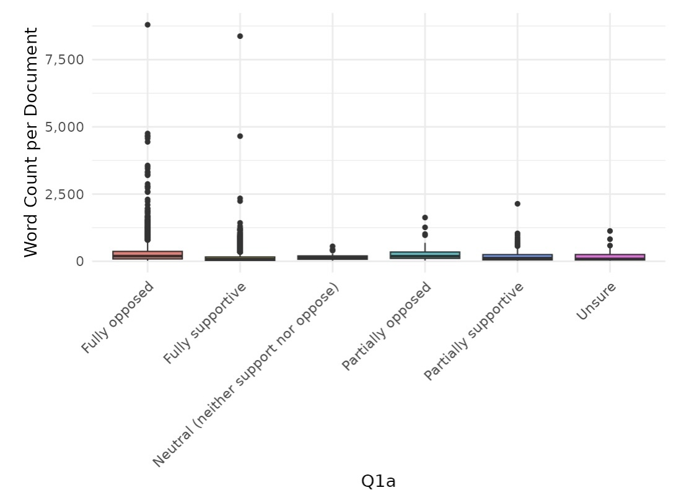 <!-- .element: class="r-stretch" -->
