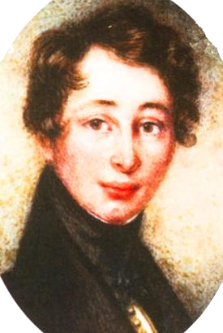
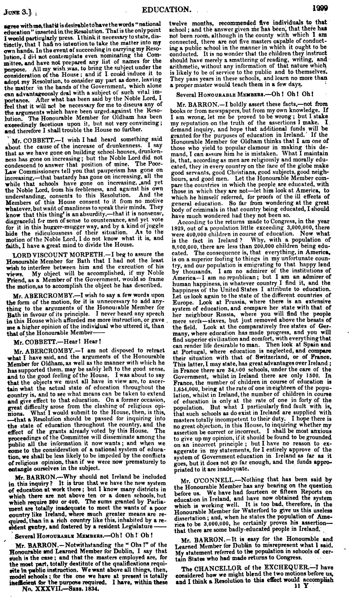
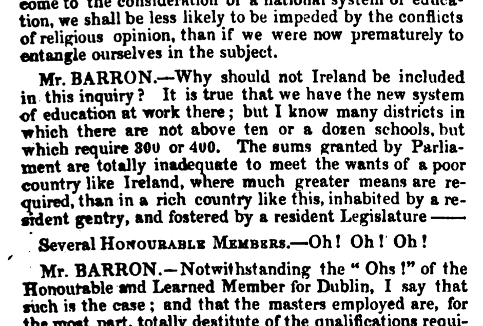
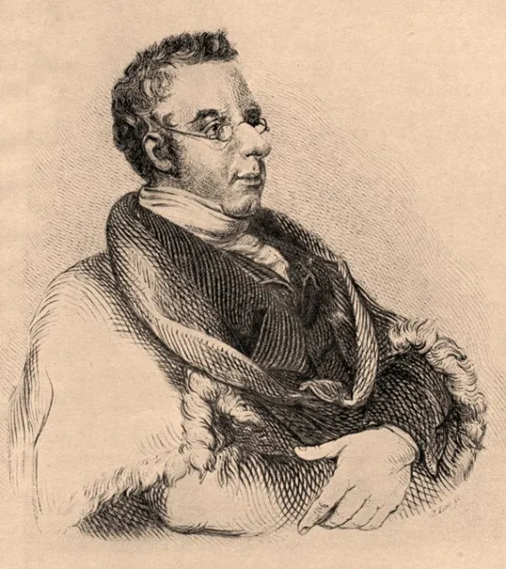
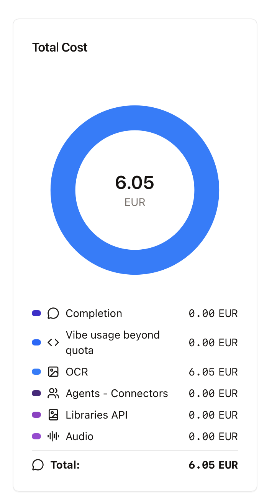

## The Mirror of Parliament

* Founded January 1828 by John Henry Barrow, barrister and journalist
* Weekly publication of parliamentary debates, both Houses
* Employed dedicated shorthand writers in the chamber
* One of those reporters: the young Charles Dickens, 'the best reporter in the gallery' (Knight 1865)

--

## What Barrow Aimed For

'...an attempt was boldly made by a gentleman named Barrow, to produce a verbal report of the proceedings of Parliament. He succeeded and carried it on for several years; and, for those years, I do not hesitate to say, that Barrow's *Mirror of Parliament* is the primary record, and not *Hansard's Debates*, because of the greater fulness which Barrow aimed at and obtained. It is within my own recollection – in the year 1833 or 1834 – just after the Reform Bill, that Gentlemen, who wanted to correct their speeches, did it for Barrow’s *Mirror of Parliament.'*

W. E. Gladstone, HC Deb 20 April 1877, c1576–77

--

## What Does It Look Like?

<figure>

<figcaption><i>Mirror of Parliament</i>, 3 June 1834</figcaption>
</figure>
<figure>

<figcaption>Excerpt from left column</figcaption>
</figure>

--

## Features of the Mirror

* Published weekly, so on average about three days after the event
* Paralinguistic markers in square brackets:
  * [Hear, hear!]
  * [Great laughter.]
  * [Cries of 'No, no!']
  * [With great warmth]
  * [Striking the Table with his hand]
* Audience reactions attributed to benches: *Opposition cheers, Ministerial laughter*

--

## How Good Is It?

Jupp (1998) compared Mirror speech lengths against contemporaneous timings:

| Speech | Reported duration | *Mirror* word count | Words/hour |
| --- | --- | --- | --- |
| Brougham on common law, 7 Feb 1828 | 6 hours 5 min | ~36,000 | ~5,900 |
| Hobhouse on Navarino, 14 Feb 1828 | 1 hour 45 min | ~13,000 | ~7,400 |
| Peel on Catholic Relief, 5 Mar 1829 | 4 hours 15 min | ~24,000 | ~5,600 |
| Lord Hawick, 8 Jun 1830 | 15 min | ~1,400 | ~5,600 |

Jupp 1998: 236

~6,000 words an hour is the pace of a lecture carefully delivered from a text

--

## Why Don't We Know About It?

* The *Mirror* was ruinously expensive to produce
* Barrow's personal loss: £5,000 (£450k/€520k in 2026 equivalent)
* Ceased publication October 1841
* No digital edition, survives as some scanned PDFs or hardcopies in research libraries
* Only a handful of scholarly citations (Brown 1955; McBath 1970; Jupp 1998)
* Barrow died in 1858, buried in a pauper's grave at Norwood

---

## The Competition

* 'I obtain them from the London newspapers, the country newspapers, and from the reports supplied by the Press Association. They are then passed into the hands of the collators...' – T.C. Hansard Jr, 1888
* Often sent to speakers for correction or just used the speaker's manuscript
* '...no more the speech uttered by them in the House of Commons than it is a Welsh ballad. [...] We are duping the unborn generations. With open eyes we are sowing the seeds of dissension between historians of another age.' (*Daily News*, 8 August 1853)
* 'I hold myself bound for the *bona fides* of the reports, not for their literal accuracy' – T.C. Hansard Jr, 1862

--

<!-- .slide: data-background-image="img/side-by-side1.png" data-background-size="contain" -->

--

<!-- .slide: data-background-image="img/speechlengthdistribution.png" data-background-size="contain" -->

---

## 203-Day Pilot Mirror Corpus

| | *Mirror of Parliament* | *Hansard* |
| --- | --- | --- |
| Speeches | 25,432 | 12,936 |
| Tokens | 8,561,360 | 5,067,830 |
| Unique speakers | 2,969 | 1,355 |
| Unique debate titles | 2,596 | 835 |

* 1834: Tolpuddle Martyrs, Poor Law debates, Irish Church Appropriation, brought down Lord Grey's government

* 1839, 15 April to 3 June: Bedchamber Crisis, Melbourne's resignation, Peel's failed attempt to form a government, Victoria's refusal to change her ladies-in-waiting, Melbourne's return

* 1840, 16 January to 23 March: Prince Albert's precedence and income

--

## Building the Pilot Mirror Corpus

* 6,300 pages of *Mirror* scans
* OCR via Mistral's vision language model API (mistral-ocr-2505, late November 2025)
* Total OCR cost for 8.5 million tokens of nineteenth-century parliamentary text: **€6.05**

--

## Vision OCR for the Mirror

* VLM models (particularly Qwen and Mistral): text similarity scores up to 3-4 times higher than traditional OCR methods on complex scanned documents, especially on documents with complex layouts or poor scan quality
* Why Mistral? EU company, 94.9% accuracy across diverse document types, outperforming Google Document AI (83.4%) and Azure OCR (89.5%), n.b. 2025 figures(!)
  * Nineteenth-century parliamentary typography – longer-than-em-dashes, hyphenated line-breaks, running headers, column structure, small-caps speaker labels – handled well
  * Output: structured markdown per page
* Per-character confidence scores, standard in traditional OCR, are generally unavailable from these systems, complicating systematic quality evaluation
* In my manual checking of the Mirror transcriptions, 40 random pages, Mistral vastly outperformed Tesseract

--

## Mistral vs Tesseract

<h4>Tesseract</h4>

Mr. BARRON.—Why should not Ireland be included
iu. this inquiry? It is true that we have the new system
of education at work there; but I know many districts in
which there are not above ten or a dozen schools, but
which require 800 or 4v0. The sums granted by Parlia-
ment are totally inadequate to meet the wants of a poor
country like Ireland, where much greater means are re-
quired, than in a rich country like t is, inhabited by a re-
srdent gentry, and fostered by a resident Legislature ——

” Several Honounasie Mempers.—Oh! Oh! Oh!

--

## Mistral vs Tesseract

<h4>Mistral</h4>

Why should not Ireland be included in this inquiry? It is true that we have the new system of education at work there; but I know many districts in which there are not above ten or a dozen schools, but which require 300 or 400. The sums granted by Parliament are totally inadequate to meet the wants of a poor country like Ireland, where much greater means are required, than in a rich country like this, inhabited by a resident gentry, and fostered by a resident Legislature—

Several Honourable Members.—Oh! Oh! Oh!

--

## Corpus Pipeline

* Raw OCR → correction pipeline (hyphen rejoin, spell-check with historical whitelist, LaTeX cleanup)
* Corrected pages → speech segmentation (speaker identification from period title conventions)
* Structured speeches → annotation (spaCy POS + lemma, PyMUSAS semantic tags)
* Parallel *Hansard* fetched from parliament.uk API into the same pipeline and schema (rather than refactor my existing corpus)
* Output: unified Parquet dataset, both corpora, ready for R/Python

---

## Paralinguistics

* **939 paralinguistic markers** across the three pilot periods
* Classified into approval, disapproval, laughter, procedural, manner, interjection:

--

<!-- .slide: data-background-image="img/paralinguistic.png" data-background-size="contain" -->

--

<!-- .slide: data-background-image="img/laughter.png" data-background-size="contain" -->

--

<!-- .slide: data-background-image="img/laughter-where.png" data-background-size="contain" -->

--

## More and More Markers

| | 1834 | 1839 | 1840 |
| --- | --- | --- | --- |
| Speeches | 18,893 | 1,825 | 4,714 |
| Markers | 76 | 192 | 517 |
| Per speech | 0.004 | 0.105 | 0.110 |

* Marker density increases nearly 20× between 1834 and 1839
* The *Mirror* may be emphasising its verbatim-interpolation conventions?
  * Differentiation in the market?
  * Something the *Mirror's* shorthand reporters in the room can easily attest to systematically

---

## Textual Reuse

* Of 175,468 candidate speech pairs, 1,885 have z-score ≥ 5 on longest common subsequence.

* Palmerston on the Constantinople-Egypt crisis, 27 March 1840:

  * *Hansard*: '**His** hon. Friend **thought** that the British Government and Lord Ponsonby, the British Ambassador at Constantinople, **had stimulated** the Sultan to renew hostilities against the Pacha of Egypt. **He (Lord Palmerston) could** assure him that he **was** entirely mistaken.'

  * *Mirror of Parliament*: '**My** honourable Friend **thinks** that the British Government and Lord Ponsonby, the British Ambassador at Constantinople, **stimulated** the Sultan to renew hostilities against the Pacha of Egypt. **I can assure him** that he **is** entirely mistaken.'

* '...one or two cases of *direct piracy* from the reports of the Mirror of Parliament, committed by a predecessor in this branch of literature, whose former pretensions should have withheld him...' J.H. Barrow, 6 December 1831

---

## Comparative Signatures

* USAS semantic tag Z8m (he/him pronoun): **3.1× more frequent in *Hansard***
  * Third-person conversion at scale
  * *Hansard*: 'The Hon. Member said *he* believed...'
  * *Mirror*: '*I* believe...'
* Grammatically:
  * *Mirror* has more INTJ (+22%), PRON (+3.8%)
  * *Hansard* has more PROPN (+4.9%)
  * The interjection and pronoun profile is a bit of a spontaneous-speech indicator
  * The proper noun excess in *Hansard*: third-person re-introducing speakers by name where *Mirror* leaves a pronoun

---

## Conclusions

1. **OCR has changed:** Vision language models make digitisation of historical text dramatically cheaper; the barrier to building decent, quick corpora from nineteenth-century print has dropped by orders of magnitude

2. **We have good verbatim speech from this period:** Not full of hesitation markers or phonetic detail, but near-complete 'tidied' transcription of what was *generally said,* confirmed by independent timing evidence and with some paralinguistic markers showing where the audience reacted, when they laughed, when they objected

3. **The theatrics of Parliament:** Knowing where applause, laughter, and cries of 'No, no!' fell in a debate lets us see more of the performative culture of the 1830s Commons and Lords – and enables direct comparison with modern parliamentary behaviour

---

## References

Alexander, Marc. 2023. 'Speech in the British *Hansard*'. In Korhonen, Kotze & Tyrkkö (eds.) *Exploring Language and Society with Big Data*. Amsterdam: John Benjamins. 17–53.

Brown, Everett S. 1955. 'John Henry Barrow and the *Mirror of Parliament*.' *Bulletin of the Institute of Historical Research* 28. 76–84.

Carlton, William J. 1965. 'Dickens's Literary Mentor.' *Dickens Studies* 1(2). 54–64.

Jupp, Peter. 1998. *British Politics on the Eve of Reform*. Basingstoke: Macmillan.

Vice, John. 2018. 'Charles Dickens and Gurney's Shorthand.' *Language and History* 61. 77–93.

Vice, John & Stephen Farrell. 2017. *The History of Hansard*. London: House of Lords Library.

---

## Spare: Vision Language Model OCR

* Traditional OCR (Tesseract): character recognition → text
* VLM OCR (Mistral, GPT-4V) uses a unified vision-language model
* Divides the page image into small patches (15x15 pixels), embeds them with positional information, processes them through self-attention layers to produce a sequence of visual token embeddings
* Visual tokens projected into the same vector space as the language model's text tokens; transcription generated autoregressively, token by token, doing layout analysis, character recognition, and linguistic context in a single pass
* Significant quality gains on historical text (robust to degradation, diverse typefaces, and unusual layouts) combined with linguistic priors
* Central risk: system fails by producing fluent confabulation rather than transparent garbling

---

## Spare: What Next

* Full 1828–1841 corpus (all surviving Mirror volumes)
* Systematic comparison with newspaper sources (*Times*, *Morning Chronicle*)
* Analysis of editorial overlap and plagiarism

