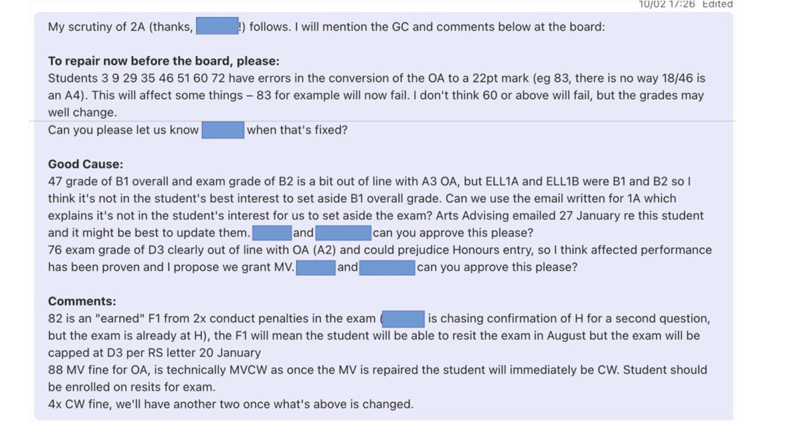
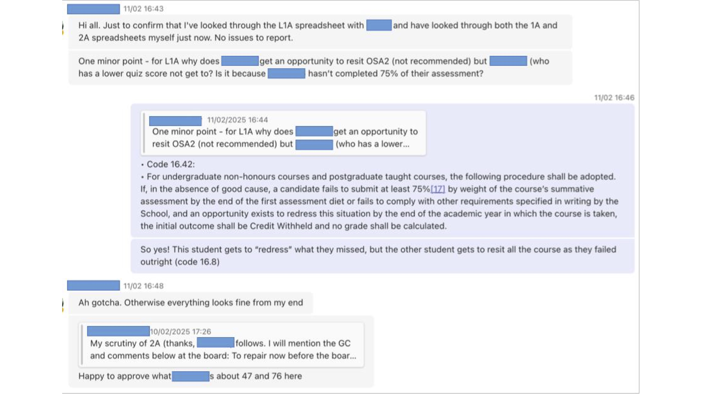
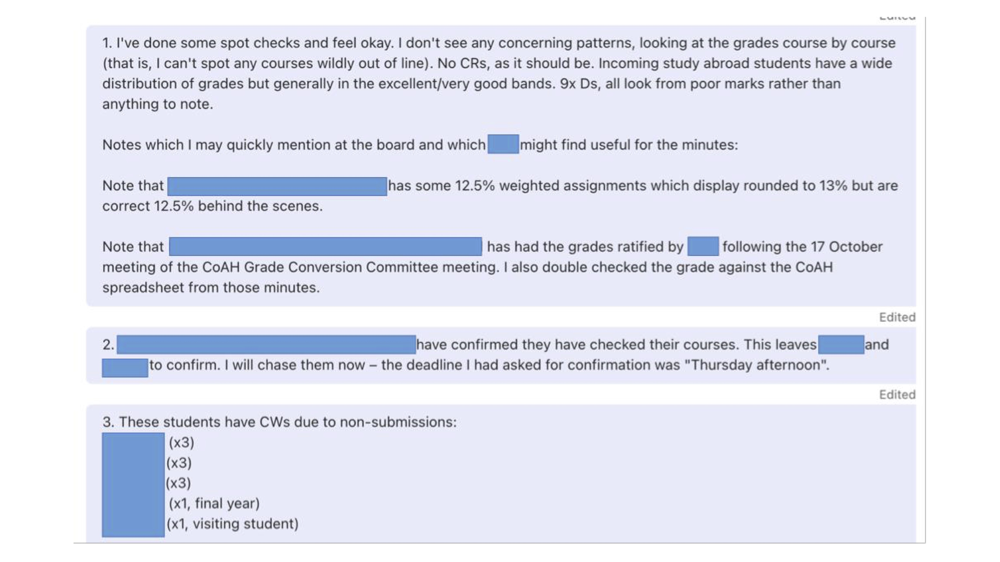
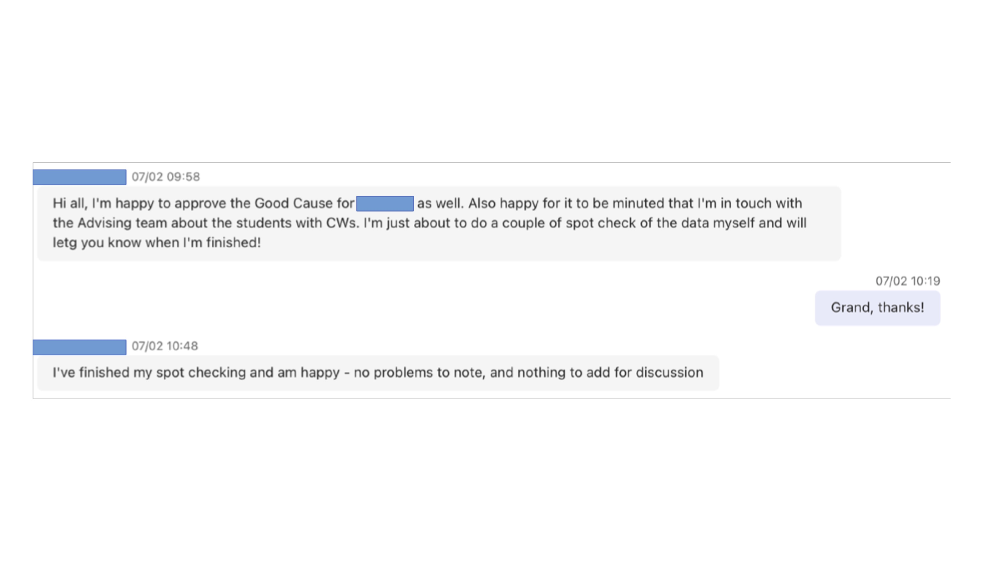

## Pre-Scrutiny Framework

* Appoint Scrutineers
  - A minimum of three designated colleagues are formally appointed to conduct pre-scrutiny checks of results before the exam board. Usually includes assessment officer.

* Schedule Pre-Scrutiny
  - Scrutiny activities occur in the days before exam boards (sometimes 24 hours before, sometimes a few days).

* Certify Findings
  - Scrutineers state in writing (email/Teams) that they are satisfied with the accuracy of reported outcomes and identify specific concerns requiring board attention.

---

## Pre-Scrutiny Procedures – Course Conveners

* Assessment Weightings (Course Conveners)
  - Confirm all assessment components are correctly weighted and present in the spreadsheet calculations. This ensures the final grade accurately reflects the assessment structure. (Course conveners can be asked to do this.)

* Sampling (Course Conveners)
  - Conduct spot checks for several randomly selected students, comparing grades in Moodle or MyGrades against those recorded in board spreadsheets.

---

## Pre-Scrutiny Procedures – Scrutineers

* Sampling
  - Conduct spot checks for randomly selected students to check that the spreadsheet outcome matches what should be the outcome. Scan the spreadsheet for anomalous patterns in grades or unusual outliers.

* Complex Case Review
  - Examine cases with special grades (MV, NS) and students with unusual or complex course outcomes (CW, CR, fails) to ensure proper recording of these exceptional circumstances. Sorting the spreadsheet by final grade helps with this.

* Overall Review
  - Check all looks complete (or incompleteness is explained) and internal consistency

---

## Scrutineer Discussions (Teams)

* Flag Anomalies
  - Identify and document any discrepancies or concerns requiring discussion by scrutineers or by the exam board

* Propose Solutions
  - Discuss preliminary recommendations with other scrutineers for discrepancies or identified issues, or check with Advising or other colleagues for input

* Document Findings
  - Send (email/Teams) a confirmation of pre-scrutiny and any suggested items to be presented to the board

---

## Board Attendance

* All attendees of a board should have also completed their own scrutiny in advance – they do not have to certify in advance by email or Teams, but will be listed in the board minutes as having scrutinised the material and assenting to its accuracy.

* Board attendees are sent the materials either when the scrutineers get it or once scrutiny is complete, should timescales allow.
They put time to scrutinize material in their diaries the day before.

* Colleagues without the time/inclination to read the board's material in advance don't have much to do and it's not ideal to have them minuted as having assented to outcomes they have not checked.

* Plan: separate out the exam board process from the External Examiner discussion and review, a “programme wash-up” with the EEs half an hour after the board-board.

---

## Board Discussions

* Complex Situations with Good Cause
  - The board should review all cases where good cause has been accepted but which present unusual circumstances or require special consideration for progression or award purposes, eg multiple assessment deferrals, borderline good cause decisions, progression implications.

* Missing Assessment Components
  - Any student record with incomplete assessment profiles which could lead to issues for award should be examined.

* Practice Standardisation
  - Discuss a few random samples as well as unusual or precedent-setting cases to ensure consistency in assessment practices and help train colleagues.
  - Individual uncomplicated cases will not require detailed discussion, but there should be at the board some spot checking (eg going through one or two uncomplicated cases to explain the calculations to all present).

---

## Examples

* Overleaf are some anonymized comments from different scrutineers to give an indication of the sorts of activity which can happen in the pre-scrutiny
phase.

---

<!-- .element: class="r-stretch" -->

--

<!-- .element: class="r-stretch" -->

--

<!-- .element: class="r-stretch" -->

--

<!-- .element: class="r-stretch" -->
