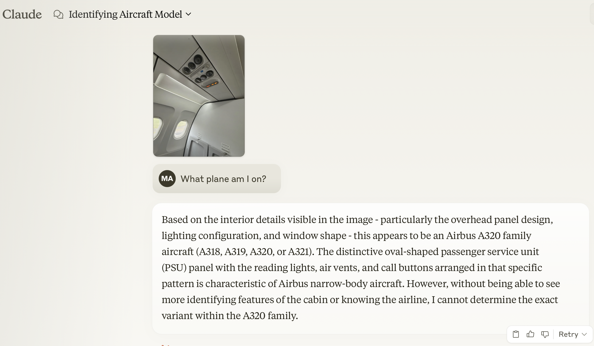
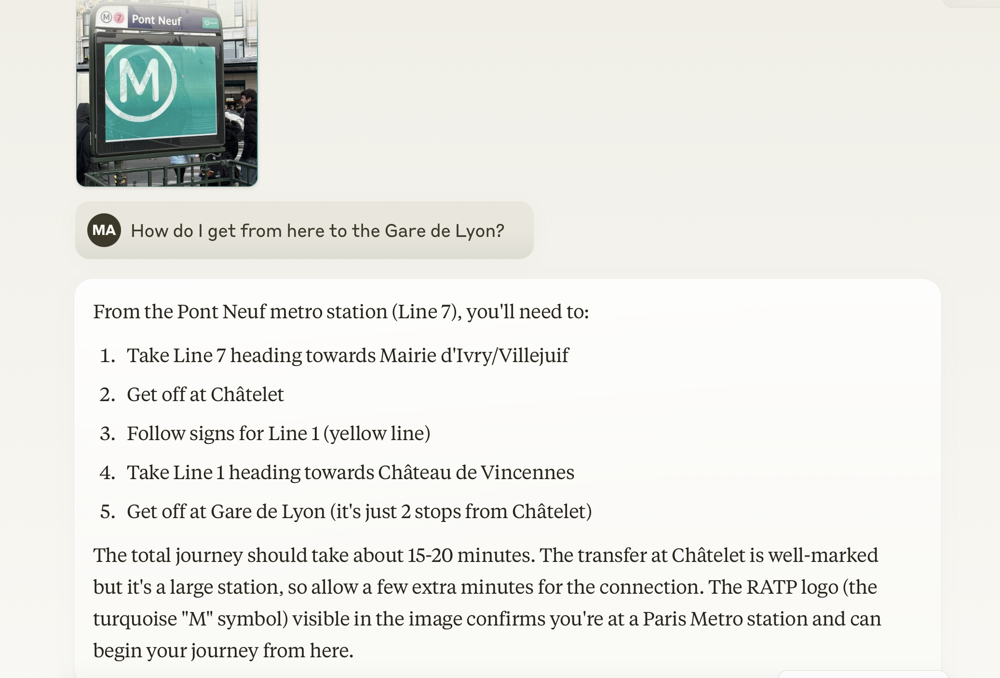
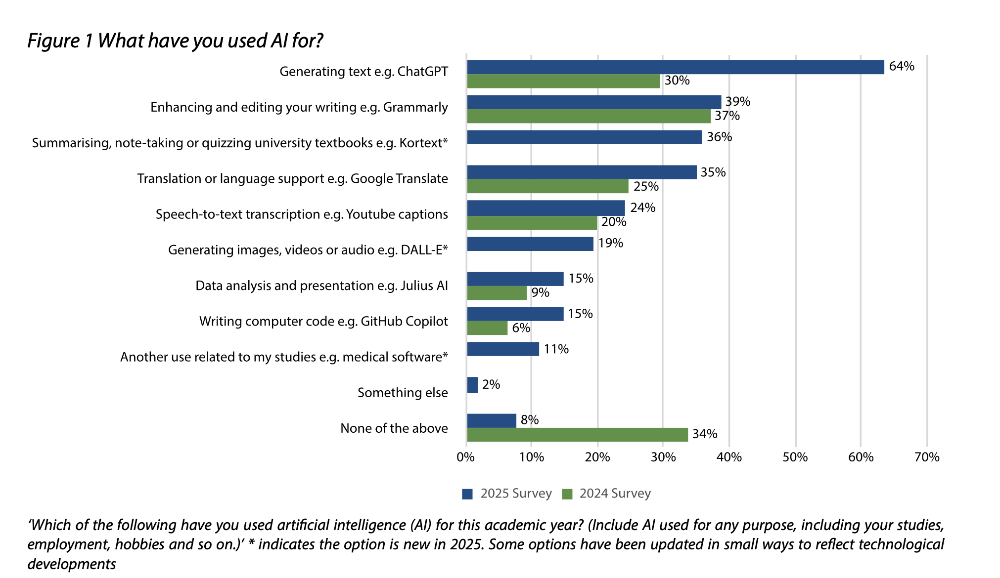
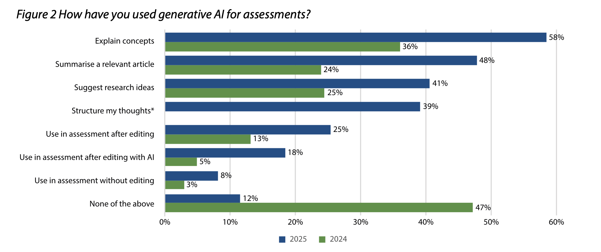
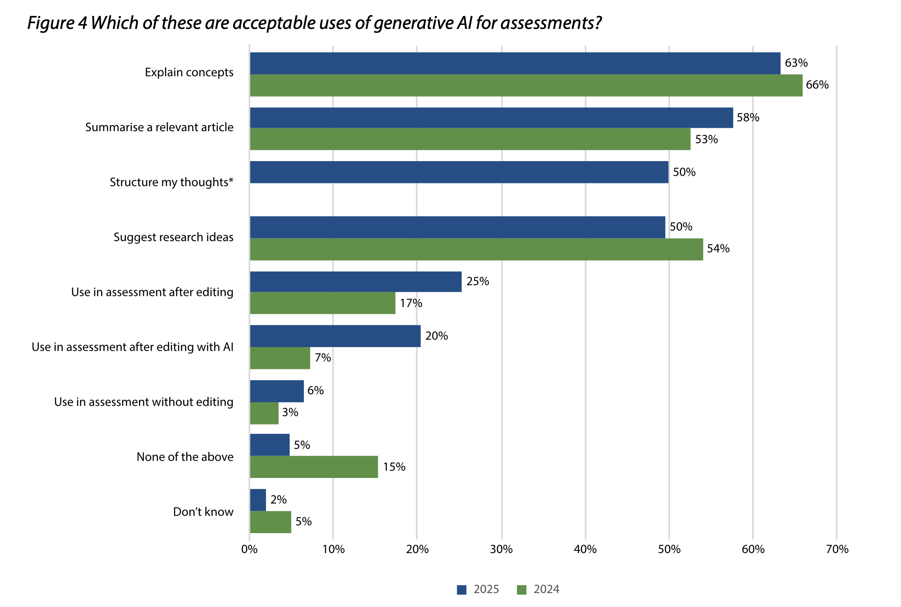
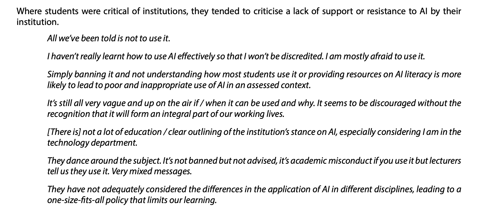

# Outline

* Current AI models
* Five recent advances
* Agentive examples
* Implications

---

## Current AI models

* OpenAI's ChatGPT
* Microsoft's Copilot
* Google's Gemini
* Meta's Llama
* Amazon's Nova
* Anthropic's Claude
* xAI's Grok
* Perplexity's Perplexity Sonar
* DeepSeek's DeepSeek
* Alibaba's Qwen
* Mistral's LeChat

--

## So-called 'frontier' models

* ChatGPT 4.5/o3 ($20/month)
* Gemini Advanced 2.0 Pro Experimental/2.0 Flash Thinking ($20/month)
* Claude 3.7 Sonnet (£18/month)
* Grok 3 (free in preview, $30/month)
* Llama 3.3 (open source; you're the product to who hosts it)
* DeepSeek v3/R1 (open source; you're the product to who hosts it)
* Qwen2.5 Max (open source; you're the product to who hosts it)
* Perplexity Pro (not a model as such, but access to others; $20/month)

--

## Glasgow's choice

* University of Glasgow has chosen Microsoft's Copilot model (not Copilot Pro)
* [LISU offer support and information](https://gla.sharepoint.com/sites/learning-innovation/SitePages/Gen-AI-Digital-Skills-for-Generative-AI.aspx)
* Access using the Copilot tab at [microsoft365.com](https://www.microsoft365.com/) or using the Copilot app, or the Copilot tab in Teams.
* *When signed in with your GUID,* chats and files 'aren’t used to train models under enterprise data protection'. Don't use files you can't store on OneDrive.
* 'If the process requires you to make a decision, as a general rule of thumb make sure that you are making that decision, not generative AI.'

---

## Five recent advances

* Reasoning/think-aloud
* Web search
* Context window increases
* Multimodal capabilities
* Agentive research

--

## Reasoning models

* Think-aloud layers
* OpenAI's o-type; Claude 3.7; Gemini Thinking; DeepSeek R1, Grok 3
* [Example](https://claude.ai/chat/7cca9282-7a91-4c0a-9018-3a01ff1b6fc6) : "What role does folk etymology and linguistic drift play in translated fairy tales into English?"

--

## Web search

* Bypasses a knowledge cut-off date
* Telling the model to pause, run a web search or two, and then add that information into the prompt
* [Example](https://www.perplexity.ai/search/what-s-the-programme-for-frida-xT1FrGR8Qnm178blJmypfg#0)

--

## Context window

* The "working memory" of a generative model in tokens (1 paragraph ~= 100 tokens)
* GPT3 (free ChatGPT model at 2022 launch): 2k tokens
* GPT3.5 Turbo (the free ChatGPT model in May 2023): 16k tokens
* Claude 2 (November 2023): 200k tokens
* Gemini 1.5 Pro (early 2025): 2m tokens
* (2m tokens is "all the text messages you have sent in the last 5 years; 8 average-length English novels; transcripts of over 200 average length podcast episodes")

--

## Multimodal capabilities

* Rather than text-to-speech models, LLMs now use speech-to-speech models, as well as so-called 'vision' models
* Often called 'voice mode' or 'advanced voice mode' for speech, or 'live mode' for video

--

<!-- .element: class="r-stretch" -->

--

<!-- .element: class="r-stretch" -->

--

## NotebookLM

* [notebooklm.google.com](https://notebooklm.google.com)
* Takes a range of sources you provide it so you can 'chat' with the sources, create briefings, study guides, test questions, timelines, FAQs, and 'audio overviews'
* Free users:
  * Up to 100 notebooks, each notebook can contain up to 50 sources, each source can be up to 500,000 words long
  * 50 chat queries per day, 3 audio overviews per day
* [Example, with thanks to James Balfour](https://notebooklm.google.com/notebook/9507b18c-d384-4955-b9db-1a967cc06942)
* [Example of more sources](https://notebooklm.google.com/notebook/3a959b5b-7d7f-4fa5-8b15-3ac92cc39213)

--

## Agentive research

* An 'agent' is an autonomous system which analyses input, makes 'decisions', and has the ability to make unsupervised actions towards a goal
* For research, this usually involves:
  * Asking a question
  * Optionally giving clarification
  * The AI agent then analysing the question, performing searches on the internet, retrieving search results, reading them, reformulating more searches, reflecting on what else needs searched for, taking note of what's relevant or useful, then iterating on this until either at a maximum or 'satisfied' about the answer
  * Writing up this process as a research note

---

## Example

* With permission, using Kyle Gunn's PhD topic in ELL (to be submitted in the next few weeks 🤞🏻)
* Compared one of his research questions put into an AI:
  * Simple prompt, free model
  * Slightly better prompt, paid-for model
  * Free agentive research
  * Paid-for agentive research

--

## Prompts

* How do English speakers use metaphors and other strategies to represent the sensation of smelling perfume in written text?
* For a PhD level linguist interested in how English speakers use metaphors and other strategies to represent the sensation of smelling perfume in written text, produce a report focusing on academic research and corpus linguistics which comprehensively answers this question.
  * Investigate how English speakers use metaphors and other linguistic strategies to evoke the sensation of smelling perfume in written text. Apply corpus analysis to study large-scale data, drawing out patterns, trends, and subtleties in how perfume scents are described. You are preparing this research for a PhD thesis that focuses on linguistic representations of smell, particularly in the domain of perfume descriptions. The objective is to produce a data-driven study that can reveal underlying patterns, novel conceptual metaphors, and any emerging trends in English discourse relating to scent.

--

## Simple prompt, free model

* ChatGPT, no login
* Likely GPT 4o-mini
* Poor response: generic, random examples, shallow writing, brief, overreliance on bullets, irrelevant material, eg:
  * **7. Contrast and Juxtaposition** Describing the perfume in relation to other scents or experiences, especially contrasting ones, can highlight its unique characteristics. *"Amid the musky scent of leather, the perfume was like a breath of fresh air," or "Her perfume was a stark contrast to the stale, musty room."*

--

## Better prompt, paid model

* ChatGPT Plus using GPT o3-mini-high (a 'reasoning' model)
* Gives references to the literature, more textual, writing still has some AI-isms, but pretty decent. With some data analysed and more citations added, would be a decent foundation for an Honours essay.
* [Link](https://chatgpt.com/share/67c94ef5-6b24-800e-8ce1-245035bf54e9)

--

## Agentive research 1

* Perplexity using 'deep research', free users get five deep research queries a day
* [Link](https://www.perplexity.ai/search/for-a-phd-level-linguist-inter-btUVrBI8Qs.G2NF9.IWfvw)
* 1,847 words

--

## Agentive research 2

* ChatGPT Plus using 'deep research'
* [Link](https://chatgpt.com/share/67c87be1-2778-800e-9aac-f31f0c1c3162)
* 6,394 words
* Kyle:
  * "It’s picked up a lot of stuff I thought was important and took me a fair amount of work to find— the cross-sensory stuff, personification, and the dominant semantic fields are pretty spot on as well with the food, plants, cross-sensory stuff and character. Interesting that it’s also picked up on the sexual attraction aspect that’s going on too. I think what’s missing is that it doesn’t seem like it’s drawing much of a conclusion (what does the fact that there’s so much cross-sensory language actually entail etc) but I wonder if it could if it was asked to[?](https://chatgpt.com/share/67c87be1-2778-800e-9aac-f31f0c1c3162)"
* Another [topic](https://chatgpt.com/share/67c9524c-ded4-800e-bad5-4f484ef1e1a5)

--

## Two further research examples

* [TEI-XML encoding of an early modern letter](https://claude.ai/share/9ab39b30-bcd7-418d-a280-cd2b83d0c4e3)
* [OCRing 19th-century parliamentary text](https://gemini.google.com/app/f01c5018aba56b98)

--

## More

* Try Gamma for slides
* Try Scite and Elicit for finding papers
* Try Research Rabbit for finding new articles and authors to read
* Try Napkin for diagrams for teaching

---

## Implications

* HEPI's February 2025 report (survey of 1,041 undergraduates):
  * "In 2025, we find that the student use of AI has surged in the last year, with almost all students (92%) now using AI in some form, up from 66% in 2024, and some 88% having used GenAI for assessments, up from 53% in 2024. The main uses of GenAI are explaining concepts, summarising articles and suggesting research ideas, but a significant number of students – 18% – have included AI-generated text directly in their work."
  * "In new questions for 2025, we found that just under half (45%) of students had used AI while at school, and more students agree AI-generated content would get a good grade in their subject (40%) than disagree (34%)."

--

<!-- .element: class="r-stretch" -->

--

<!-- .element: class="r-stretch" -->

--

<!-- .element: class="r-stretch" -->

--

<!-- .element: class="r-stretch" -->

--

## Implications for us (a personal view)

* Personally, with regards to integrity, I find it harder and harder to see a medium or long term route to *prevention* which isn't an educational one rather than a disciplinary one
* Newer models (and today's paid-for models will be the free versions in a few months) are significantly more advanced and make unapproved use harder to detect
* Some training in prompting makes unapproved use harder to detect
* It's not going away
* More and more people will get premium models 'bundled'
* *Whether or not* students should use AI is now pretty much a redundant question

--

## 'Going backwards'

* Invigilated exams are sometimes seen as attractive
* QAA: '...a regressive solution that would reverse much recent progress around accessibility. It is a form of assessment for which many cohorts of students are increasingly ill prepared in their prior education and one that is not authentic in that it tends to require a narrow range of competencies, such as the retention of facts as well as handwriting significant amounts of text under time limitations that are simply not relevant in contemporary life.'
* Glasgow has refused to permit on-campus exams except in very particular circumstances (eg accreditation)

--

## QAA's suggestions 1

* Observed competence: 'observe a student complete one or more specific tasks related to their discipline [...] and interview them about their understanding of the related principles, context and applications' (OSCE-style)
* Oral examinations ('with appropriate safeguards'): 'oral examinations in the form of structured interviews conducted by two or more examiners with clearly set out rubrics and appropriate safeguards for vulnerable students may be used formatively or summatively as a synoptic assessment. In addition, mini-vivas, in which small groups of students are interviewed together about their written submissions, can serve both to authenticate the work and contribute to its assessment'
* There are volume implications here, but then again we overassess right now anyway

--

## QAA's suggestions 2

* Coursework that integrates AI by design: the AI 'completes routine and/or repetitive tasks'
* Hybrid submissions, including student work and AI together: 'allowing hybrid submissions in which the contribution of AI is fully acknowledged [...] is a useful transitional arrangement as providers plan for the near future in which Generative Artificial Intelligence is embedded in the licensed software used by staff and students'

--

## Foundational skills

* I can use AI fairly well because I had to learn the foundational skills to interrogate and check it
* What does a course look like which promotes foundational skills in learning and assessment in a non-punitive way, and how does that shift the balance between disciplinary detail and more general critical awareness?
* What knowledge and skills do we prioritise in value? What is judicious AI use and where does that learning take place?
* We are not maps in an age of satnav, but we need to articulate what our assessments are meant to *do*

--

## Alicja Syska on the essay 1

* Writing is a way to clarify and undertake deep thinking
* [We tried to kill the essay – now let’s resurrect it](https://blogs.lse.ac.uk/highereducation/2025/02/27/we-tried-to-kill-the-essay-now-lets-resurrect-it/)
* Alicja Syska: 'We have ruined essay-writing by forgetting about it as a process and treating it as a product. We offered our students a simple transaction – an essay for a grade. We standardised marking, calibrated our expectations, and created a culture of measuring learning via rubrics and outcomes that do not leave much room for valuing the process. University essays became displays of competence rather than a means of growth, with all stages and results predictable, and formative assessment a burdensome addition to the already stretched marker’s workload. What may have felt like death by essay before, AI has merely finished off.'

--

## Alicja Syska on the essay 2

* 'What AI can help with is to break down the misconceptions around writing, make it more achievable, more democratic, less fraught, less intimidating, and more rewarding. It still shouldn’t be easy[...] If we can find a sustainable way to use AI as Socratic service that questions, prompts, and encourages deeper engagement with the content, and offers feedback on ideas and argument, style, and voice, but not to appropriate the exact words or answers it comes up with, then we have a chance to use it to learn and grow, rather than reduce learning gains.'
* '...reimagining the good old essay may just help us fulfil the original vision of Enlightenment education and – by treating writing as a practice of freedom – bring us closer to bell hooks’s ideal of the classroom as a location of possibility.'
